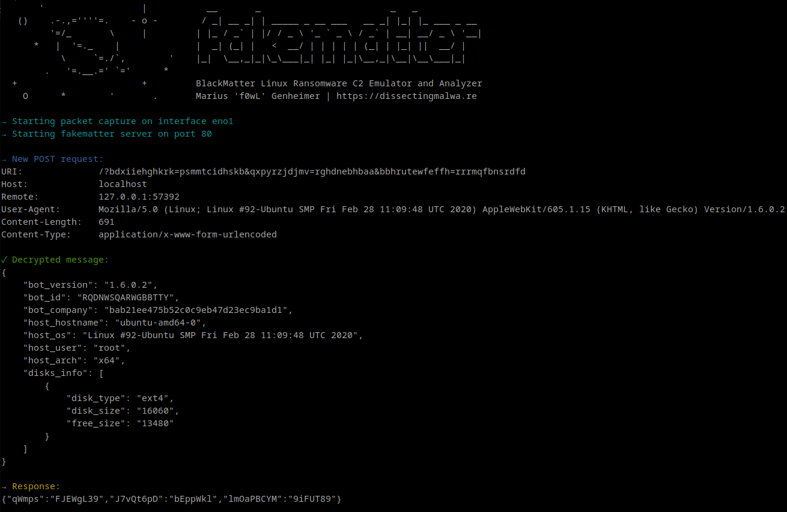

# fakematter

fakematter is a proof-of-concept implementation of a local Command&Control-Server Emulator for BlackMatter Ransomware (targeting GNU/Linux and VMware ESXi) to demonstrate the decryption of C2 communication. The tool is capable of parsing BlackMatter config files dumped with [configmatter-linux](https://github.com/f0wl/configmatter-linux). It also supports integrated packet capturing to produce PCAPs of your C2 comms.

### Usage 

1. Extract config from the BlackMatter ESXi/Linux sample
2. Set up the detonation system (modify ```/etc/hosts``` to point C2 URLs to your analysis machine)
3. Build and run fakematter:

```shell
go build fakematter.go blackmatter-linux_c2-structs.go blackmatter-linux_config-structs.go
sudo ./fakematter -iface eth0 -port 80 -j example-config/config-3f9a28e8c057e7ea7ccf15a4db81f362.json
```
### Screenshots

A local demonstration of the tool:


